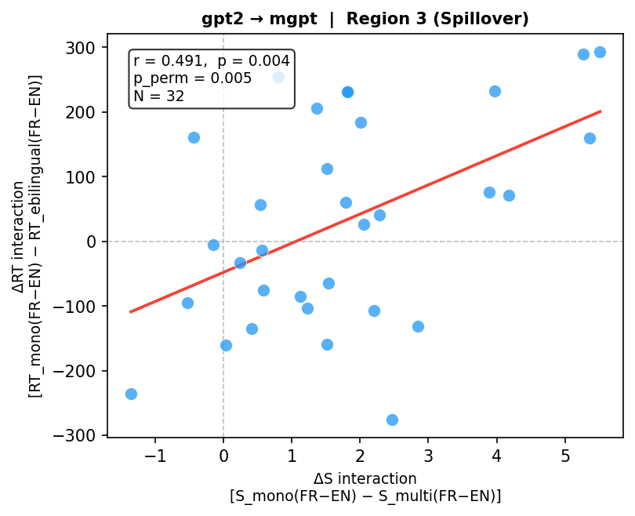
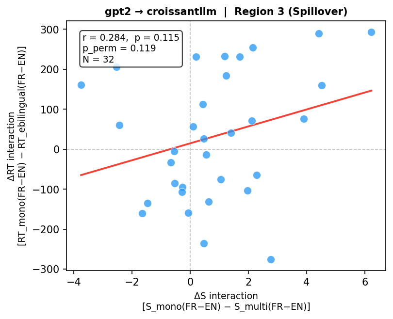
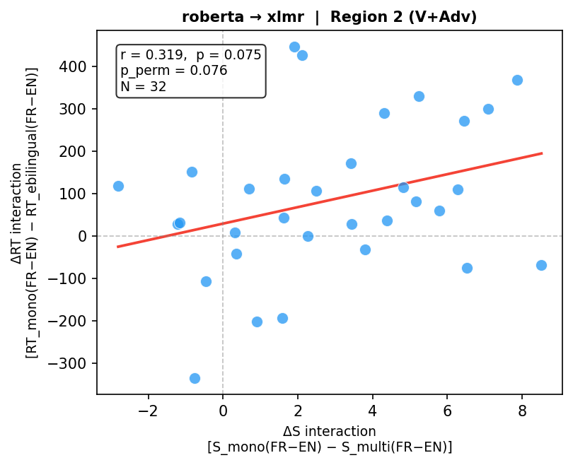
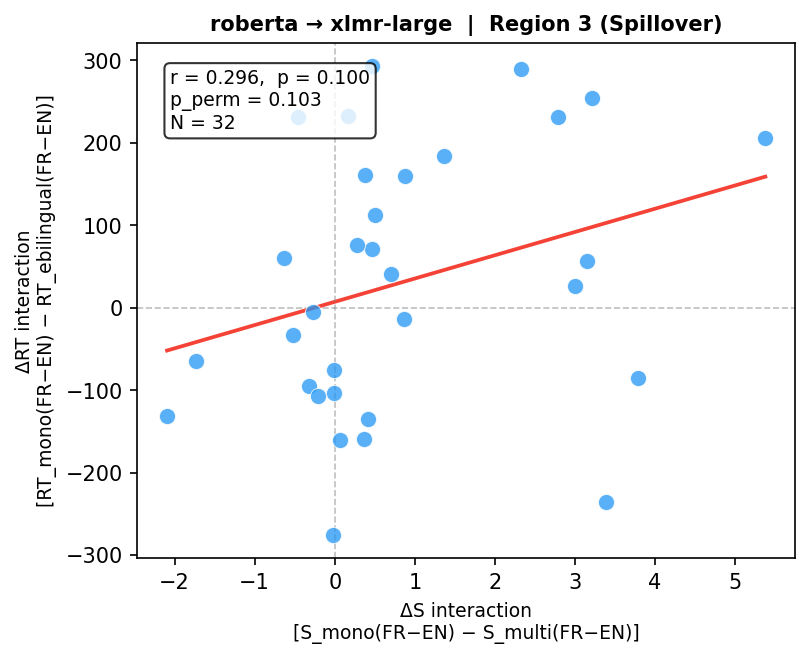

# Syntactic Bias in Multilingual Languagage Models

> *Does French syntax echo in how multilingual-language models process English?*

[](LICENSE)

A computational psycholinguistics project that uses **surprisal analysis across multilingual and monolingual LLMs** to model cross-linguistic syntactic transfer — a phenomenon documented in human bilingual processing and grounded in a published behavioral study.

---

## TL;DR

- **Problem:** When English-French bilinguals read ungrammatical English sentences that match French word order, they process them *easier* (but not neccessarily faster) than monolingual English speakers. This is syntactic transfer.
- **Question:** Do multilingual LLMs show the same pattern — lower surprisal on French-order English sentences than monolingual models?
- **Method:** Compare token-level surprisal across XLM-R vs. RoBERTa and mGPT vs. GPT-2 on matched sentence stimuli. Correlate per-item surprisal differences with human reaction time data from a maze task experiment.
- **Why it matters:** If the correlation holds, it suggests multilingual training induces the same cross-lingual syntactic biases observed in human bilingual cognition — with implications for how we evaluate and interpret multilingual model behavior.

---

## Background

Consider this English sentence:

> *John watches **often** television.*

It's ungrammatical in English — adverbs don't go between the verb and the object. But in French, Verb + Adverb + Object is perfectly natural:

> *Jean regarde **souvent** la télé.*

In a published maze task study (Xing & Sabourin, 2026, *Bilingualism: Language and Cognition*, in production), L1 English speakers showed measurable RT facilitation when reading V+Adv English sentences compared to L1 English monolinguals. The interpretation: their French grammar partially licenses the ungrammatical English structure, reducing processing difficulty.

This project asks whether that same signal is detectable in LLMs — using surprisal as a proxy for processing difficulty, and multilingual vs. monolingual training as a proxy for bilingual vs. monolingual cognition.

---

## Experimental Design

### Stimuli

Four sentence conditions, item-aligned with the behavioral study where possible:

| Condition | Example | Purpose |
|---|---|---|
| **V+Adv (critical)** | *John watches often television* | Main experimental condition |
| **Adv+V (grammatical)** | *John often watches television* | Grammatical baseline |
| **Unrelated violation** | *John television watches often* | Specificity control |
| **French source** | *Jean regarde souvent la télé* | Model sanity check |

**Critical measurement position:** the adverb token (*often*), matching the RT measurement point in the maze task.

### Model Comparison

#### Masked LMs (PLL — Salazar et al. 2020; PLL-word-l2r — Kauf & Ivanova 2023)

| Monolingual English | Multilingual | Notes |
|---|---|---|
| RoBERTa-base | XLM-R-base | **Primary pair** — identical architecture and training objective; multilingualism is the only variable |
| BERT-base-uncased | mBERT (bert-base-multilingual-cased) | Classic pair; adds BERT vs. RoBERTa architecture contrast |
| DistilBERT-base-uncased | DistilmBERT | Tests whether the effect survives distillation |
| RoBERTa-base | XLM-R-large | Scale-up check within the same architecture family |

#### Causal LMs (token-level surprisal from logits)

| Monolingual English | Multilingual / Bilingual | Notes |
|---|---|---|
| GPT-2 | mGPT | **Primary pair** |
| GPT-2 | CroissantLLM-Base | 50/50 EN/FR training — closest LLM analog to the human bilingual participants |
| OPT-125M | BLOOM-560M | Larger-scale; note different positional encoding (ALiBi vs. learned) |
| Pythia-160M | BLOOM-560M | Well-documented English-only baseline vs. BLOOM |

The **XLM-R vs. RoBERTa** contrast remains the primary comparison. All multilingual models listed include substantial French training data.

### Surprisal Metrics

- **Causal LMs:** standard token-level surprisal — negative log probability given left context.

- **Masked LMs:** two pseudo-log-likelihood (PLL) variants are computed for every region:

  | Variant | Formula | Reference |
  |---|---|---|
  | **PLL** | For each token *i*: mask *i*, record −log P(token_i \| all others) | Salazar et al. (2020) |
  | **PLL-word-l2r** | For token *t* at position *p* in word *w*: mask *t* and all tokens *t' ≥ p* in *w*, then record −log P | Kauf & Ivanova (2023) |

  PLL-word-l2r prevents the model from using within-word future subword context (e.g. `##ing` helping predict `watch` in `watching`), which is unavailable in a natural left-to-right reading. For single-subword words the two metrics are identical. Both are stored in the output CSV:

  ```
  surprisal_region2                  # standard PLL (Salazar et al. 2020)
  surprisal_region2_PLL_word_l2r     # adjusted PLL (Kauf & Ivanova 2023)
  ```

  The standard `surprisal_region*` columns are used by default in `correlation.py` (compatible with causal model output). Pass `--pll_variant PLL_word_l2r` to switch.

**Key derived metric:** per-item surprisal delta

```
ΔS(item) = surprisal_monolingual(item) − surprisal_multilingual(item)
```

A positive delta means the multilingual model is *less surprised* by the V+Adv order — the predicted direction if cross-lingual transfer is present.

### Region-Level Surprisal Aggregation

Behavioral RT is recorded per region, not per word. Surprisal is aggregated to match:

> **Summed surprisal over the region** = Σ surprisal(token) for all tokens in the region span

Summing is theoretically motivated: under surprisal theory (Levy, 2008), processing difficulty is additive across words, so a region's total cognitive cost equals the sum of its token-level surprisals.

The RT data covers four regions:

| Region | Content (V+Adv condition) | Content (Adv+V condition) | Role |
|---|---|---|---|
| Region 1 | *John* | *John* | Subject NP baseline |
| **Region 2** | *watches often* | *often watches* | **Primary — contains the syntactic manipulation** |
| **Region 3** | *television* | *television* | **Spillover check — RT often lags one region** |
| Region 4 | *at home* | *at home* | Post-critical baseline |

Both Region 2 and Region 3 are correlated with ΔS. Region 2 is the primary measure; Region 3 tests for downstream spillover effects that are common in reading-time studies.

### Tokenization Alignment Strategy

> *(Implementation note — may be removed before publication)*

LLM tokenizers (BPE, WordPiece, SentencePiece) do not split on word boundaries, so region text cannot be matched to token indices by word count alone. The strategy used here:

1. **Tokenize the full sentence** with `return_offsets_mapping=True` to get character-level `(start, end)` spans for each token.
2. **Locate the region** by finding the character offset of `region_text` as a substring of `sentence`.
3. **Select tokens** whose span falls within `[region_char_start, region_char_end)`.
4. **Sum their surprisal / PLL values** to produce the region-level score.

Edge cases to handle:
- **GPT-2 / mGPT:** prepend a space to non-initial tokens (Ġ prefix); strip whitespace from `region_text` before the substring search.
- **BERT / mBERT (WordPiece):** words may be split into `##` subword pieces; include all subword pieces that fall within the region span.
- **XLM-R / CroissantLLM (SentencePiece):** uses `▁` as a word-boundary marker; alignment via offset mapping is reliable but verify against the raw token strings.
- **BLOOM (ALiBi + byte-level BPE):** tokenizes similarly to GPT-2; offset mapping is straightforward.

### Correlation with Human Behavioral Data

Per-item ΔS is correlated with per-item mean residualized RT from the maze task (RT residualized on word length, frequency, and serial position). Pearson *r* with permutation test; Spearman *ρ* as a robustness check.

Correlations are run separately for:
- **Region 2 ΔS × Region 2 RT** — primary analysis
- **Region 3 ΔS × Region 3 RT** — spillover analysis

**Prediction:** items where multilingual models show the largest surprisal reduction are items where L1 French speakers showed the most RT facilitation — at Region 2, and potentially propagating to Region 3.

---

## Repo Structure

```
syntactic-echo/
├── data/
│   └── stimuli_generated.csv  # LLM-generated stimuli (180 items × 2 conditions)
│   # Original maze task stimuli and behavioral RT data are not included
│   # in this repository. See Data Availability below.
├── src/
│   ├── data_preprocessing.py  # RT cleaning, outlier handling, stimuli extraction
│   ├── generate_stimuli.py    # LLM-based stimulus generation (Gemini)
│   ├── surprisal_causal.py    # Token surprisal for causal LMs (GPT-2, mGPT, …)
│   ├── surprisal_masked.py    # PLL / PLL-word-l2r for masked LMs (RoBERTa, XLM-R, …)
│   └── correlation.py         # ΔS interaction computation + RT correlation analysis
├── notebooks/
│   └── analysis.ipynb         # End-to-end walkthrough with figures
├── results/
│   └── figures/               # Condition bar charts, ΔS vs. RT scatter plots
├── requirements.txt
└── README.md
```

---

## Results

Preliminary results across 8 model pairs and 4 analysis conditions (N = 32 items per pair) show a mixed but directionally informative pattern. The strongest and most consistent finding is a significant positive correlation between the GPT-2 → mGPT surprisal interaction and human RT at Region 3 (spillover: *r* = 0.491, *p* = 0.004, permutation *p* = 0.005), replicating across all four metric/RT combinations. The primary masked LM pair (RoBERTa → XLM-R) shows a trending positive correlation at Region 2 under standard PLL (*r* = 0.319, *p* = 0.075), but this effect largely disappears under the more conservative PLL-word-l2r metric (*r* = 0.046), suggesting sensitivity to within-word subword context. GPT-2 → CroissantLLM — the closest LLM analog to the human early bilingual participants — shows positive but non-significant trends at both regions (*r* = 0.236–0.284). The BERT/mBERT and DistilBERT/DistilmBERT pairs are near zero throughout. Residualizing RT on region text length leaves all results unchanged, indicating that the raw correlation pattern is not driven by surface-length differences across items. Taken together, the results offer partial support for the hypothesis: causal multilingual models track the human syntactic transfer signal more reliably than masked models under the adjusted PLL metric, with the effect localising to the spillover region rather than the primary manipulation site.

### Selected scatter plots (ΔS interaction × ΔRT interaction)

**Causal LM pairs**

| GPT-2 → mGPT — Region 3 (*r* = 0.491, *p* = 0.004) | GPT-2 → CroissantLLM — Region 3 (*r* = 0.284, *p* = 0.115) |
|:---:|:---:|
|  |  |

**Masked LM pairs (standard PLL)**

| RoBERTa → XLM-R — Region 2 (*r* = 0.319, *p* = 0.075) | RoBERTa → XLM-R-large — Region 3 (*r* = 0.296, *p* = 0.100) |
|:---:|:---:|
|  |  |

---

## Future Directions: Post-training

This project establishes a correlational baseline using pre-trained models. The natural next step is to induce syntactic transfer experimentally through post-training, which would move from correlation to a causal claim.

**Supervised fine-tuning (SFT):** Continue training a monolingual English model (e.g. GPT-2, RoBERTa) on French text and measure whether surprisal at V+Adv positions decreases post-training. A reduction would directly mirror the acquisition of cross-lingual transfer via French exposure — the same mechanism hypothesised in human bilinguals.

**RLHF / preference training:** Rather than fine-tuning on raw French text, use reinforcement learning from human feedback to reward the model for lower perplexity on French-order English constructions. This could test whether syntactic transfer can be shaped through preference signals, and whether RLHF-trained models show a stronger or more targeted surprisal shift at the V+Adv position than SFT alone — with implications for how alignment training interacts with cross-lingual syntactic representations.

---

## Requirements

```bash
pip install -r requirements.txt
```

---

## Citation

```bibtex
@article{xing2026syntactic,
  author    = {Xing, Yubin},
  title     = {Syntactic Bias in Multilingual Language Models},
  year      = {2026}
}
```

---

## Data Availability

The original maze task stimuli and behavioral RT data are from Xing & Sabourin (2026) and are **not included in this repository**. To replicate the full pipeline, please contact the authors.

The LLM-generated stimuli (`data/stimuli_generated.csv`) and all computed surprisal outputs (`results/`) are included and sufficient to reproduce the correlation analyses.

---

## License

All code in `src/` and `notebooks/` is released under the **MIT License**. See [`LICENSE`](LICENSE) for details.

---

## Author

**Yubin Xing**  
PhD Candidate, Psycholinguistics — University of Ottawa  
Computational Linguist / NLP Researcher
