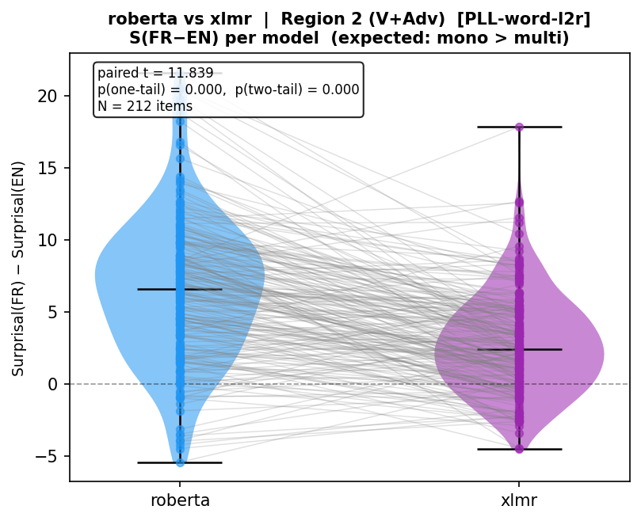
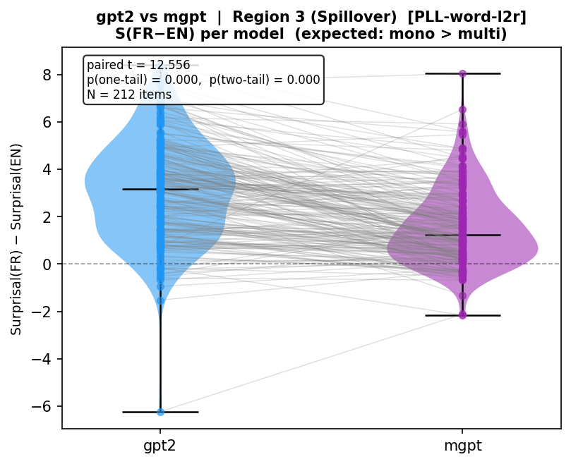
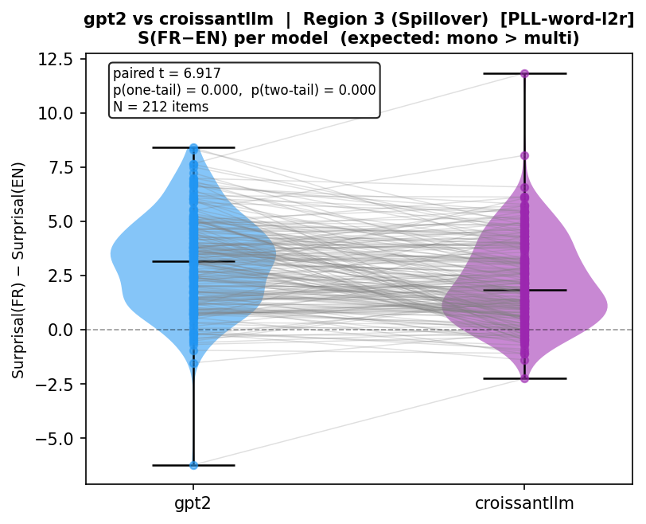
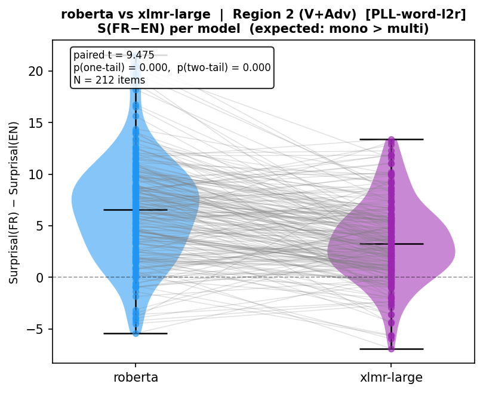

# Syntactic Bias in Multilingual Language Models

> *Does French syntax echo in how multilingual-language models process English?*

[](LICENSE)

A computational psycholinguistics project that uses **surprisal analysis across multilingual and monolingual LLMs** to model cross-linguistic syntactic transfer — a phenomenon well documented in the psycholinguistics literature on bilingual sentence processing.

---

## TL;DR

- **Problem:** When English-French bilinguals read ungrammatical English sentences that match French word order, they process them *easier* (but not neccessarily faster) than monolingual English speakers. This is syntactic transfer.
- **Question:** Do multilingual LLMs show the same pattern — lower surprisal on French-order English sentences than monolingual models?
- **Method:** Compare token-level surprisal across XLM-R vs. RoBERTa and mGPT vs. GPT-2 on matched sentence stimuli. cross-linguistic transfer is operationalized as a compressed surprisal difference between grammatical and ungrammatical English word orders in multilingual vs. monolingual models.
- **Why it matters:** Multilingual training induces measurable cross-linguistic syntactic biases — multilingual models treat ungrammatical English structures as less anomalous when those structures are licensed by another language in their training data. This has direct implications for how we evaluate and audit multilingual model behavior, which is a non-trivial matter when implementing LLMs in the field of machine translation, language assessment, and other grammar-sensitive NLP domains.

---

## Background

Consider this English sentence:

> *David visits **regularly** the local gym after his classes.*

It's ungrammatical in English — adverbs don't go between the verb and the object. But in French, Verb + Adverb + Object is perfectly natural:

> *David visite **régulièrement** la salle de sport locale après ses cours.*

In the psycholinguistics literature, grammatical violation effects in bilingual processing are well documented: English-French bilinguals show measurable processing facilitation when reading V+Adv English sentences compared to L1 English monolinguals, suggesting that their French grammar partially licenses the ungrammatical English structure.

This project asks whether that same signal is detectable in LLMs — using surprisal as a proxy for processing difficulty, and multilingual vs. monolingual training as a proxy for bilingual vs. monolingual cognition.

---

## Experimental Design

### Stimuli

Four sentence conditions:

| Condition | Example | Purpose |
|---|---|---|
| **V+Adv (critical)** | *David visits regularly the local gym after his classes* | Main experimental condition |
| **Adv+V (grammatical)** | *David regularly visits the local gym after his classes* | Grammatical baseline |
| **French source** | *David visite régulièrement la salle de sport locale après ses cours* | Model sanity check |

**Critical measurement position:** the adverb token (*regularly*) — the point of syntactic disambiguation.

### Model Comparison

#### Masked LMs (PLL — Salazar et al. 2020; PLL-word-l2r — Kauf & Ivanova 2023)

| Monolingual English | Multilingual | Notes |
|---|---|---|
| RoBERTa-base | XLM-R-base | **Primary pair** — identical architecture and training objective; multilingualism is the only variable |
| BERT-base-uncased | mBERT (bert-base-multilingual-cased) | Classic pair; adds BERT vs. RoBERTa architecture contrast |
| DistilBERT-base-uncased | DistilmBERT | Tests whether the effect survives distillation |
| RoBERTa-base | XLM-R-large | Scale-up check within the same architecture family |

#### Causal LMs (token-level surprisal from logits)

| Monolingual English | Multilingual / Bilingual | Notes |
|---|---|---|
| GPT-2 | mGPT | **Primary pair** |
| GPT-2 | CroissantLLM-Base | 50/50 EN/FR training — closest LLM analog to the human bilingual participants |
| OPT-125M | BLOOM-560M | Larger-scale; note different positional encoding (ALiBi vs. learned) |
| Pythia-160M | BLOOM-560M | Well-documented English-only baseline vs. BLOOM |

The **XLM-R vs. RoBERTa** contrast remains the primary comparison. All multilingual models listed include substantial French training data.

### Surprisal Metrics

- **Causal LMs:** standard token-level surprisal — negative log probability given left context (Hale, 2001; Levy, 2008).

- **Masked LMs:** two pseudo-log-likelihood (PLL) variants are computed for every region:

  | Variant | Formula | Reference |
  |---|---|---|
  | **PLL** | For each token *i*: mask *i*, record −log P(token_i \| all others) | Salazar et al. (2020) |
  | **PLL-word-l2r** | For token *t* at position *p* in word *w*: mask *t* and all tokens *t' ≥ p* in *w*, then record −log P | Kauf & Ivanova (2023) |

  PLL-word-l2r prevents the model from using within-word future subword context (e.g. `##ing` helping predict `watch` in `watching`), which is unavailable in a natural left-to-right reading. For single-subword words the two metrics are identical. Both are stored in the output CSV:

  ```
  surprisal_region2                  # standard PLL (Salazar et al. 2020)
  surprisal_region2_PLL_word_l2r     # adjusted PLL (Kauf & Ivanova 2023)
  ```

  The standard `surprisal_region*` columns are the default output. Pass `--pll_variant PLL_word_l2r` to switch to the Kauf & Ivanova variant.

**Key derived metric:** per-item surprisal delta

```
ΔS(item) = surprisal_monolingual(item) − surprisal_multilingual(item)
```

A positive delta means the multilingual model is *less surprised* by the V+Adv order — the predicted direction if cross-linguistic transfer is present.

### Region-Level Surprisal Aggregation

Surprisal is aggregated over sentence regions, following the psycholinguistic convention of region-level analysis:

> **Summed surprisal over the region** = Σ surprisal(token) for all tokens in the region span

Under surprisal theory (Hale, 2001; Levy, 2008), processing difficulty is additive across words, so a region's total cognitive cost equals the sum of its token-level surprisals. Surprisal has been shown to predict reading times on a logarithmic scale (Smith & Levy, 2013).

Sentences are parsed into four regions:

| Region | Content (V+Adv condition) | Content (Adv+V condition) | Role |
|---|---|---|---|
| Region 1 | *David* | *David* | Subject NP baseline |
| **Region 2** | *visits regularly* | *regularly visits* | **Primary — contains the syntactic manipulation** |
| **Region 3** | *the local gym* | *the local gym* | **Spillover — processing effects commonly propagate one region downstream** |
| Region 4 | *after his classes* | *after his classes* | Post-critical baseline |

Region 2 is the primary measure; Region 3 tests for downstream spillover, which is commonly observed in reading-time studies.

---

## Repo Structure

```
syntactic-echo/
├── data/
│   └── stimuli_generated.csv  # LLM-generated stimuli (180 items × 2 conditions)
├── src/
│   ├── generate_stimuli.py    # LLM-based stimulus generation (Gemini)
│   ├── surprisal_causal.py    # Token surprisal for causal LMs (GPT-2, mGPT, …)
│   └── surprisal_masked.py    # PLL / PLL-word-l2r for masked LMs (RoBERTa, XLM-R, …)
├── notebooks/
│   ├── correlation.ipynb      # End-to-end walkthrough with figures
│   └── ui.py                  # ipywidgets UI for correlation analysis and plotting
├── results/
│   ├── PLL, PLL_word_l2r               # Violin plots and paired t-test visualizations
│   └── surprisal_<model>.csv  # Per-model surprisal outputs (one file per model)
├── requirements.txt
└── README.md
```

---

## Results

### Hypothesis 1 — Multilingual models are less penalised by French word order

**Test:** Paired t-test of S(FR−EN) per item, comparing monolingual vs. multilingual model within each pair. A significantly positive mean difference indicates the monolingual model assigns higher surprisal to French-order English sentences (relative to the grammatical English baseline) than the multilingual model if cross-linguistic syntactic bias is present.

**This hypothesis is strongly and consistently supported across all model pairs.**

All four masked LM pairs show highly significant differences at Region 2 (all *t* > 5, *p* < .001, N = 212 items), with RoBERTa → XLM-R producing the largest effect (mean difference = 3.81 nats, *t* = 11.84). All four causal LM pairs reach significance at Region 3 (spillover): GPT-2 → mGPT (*t* = 12.56), OPT-125M → BLOOM-560M (*t* = 11.04), Pythia-160M → BLOOM-560M (*t* = 9.38), and GPT-2 → CroissantLLM (*t* = 6.92). The notable exceptions are GPT-2 → CroissantLLM at Region 2 (*t* = −3.41, reversed direction) and GPT-2 → mGPT at Region 2 (*t* = 0.31, non-significant), suggesting cross-linguistic transfer in causal models is stronger at the spillover region than at the critical word itself — consistent with the spillover topology observed in human reading time studies.

**Full results** (PLL-word-l2r; N = 212 items per pair):

| Model pair | Type | Region 2 *t* | Region 2 *p* | Region 3 *t* | Region 3 *p* |
|---|---|---:|---:|---:|---:|
| RoBERTa → XLM-R | masked | **11.84** | < .001 | **6.61** | < .001 |
| RoBERTa → XLM-R-large | masked | **9.48** | < .001 | **6.37** | < .001 |
| DistilBERT → DistilmBERT | masked | **6.46** | < .001 | −0.52 | .605 |
| BERT → mBERT | masked | **5.51** | < .001 | **2.57** | .011 |
| GPT-2 → mGPT | causal | 0.31 | .759 | **12.56** | < .001 |
| OPT-125M → BLOOM-560M | causal | 1.33 | .185 | **11.04** | < .001 |
| Pythia-160M → BLOOM-560M | causal | −0.50 | .616 | **9.38** | < .001 |
| GPT-2 → CroissantLLM | causal | −3.41 | .001 ↓ | **6.92** | < .001 |

*Bold = significant in predicted direction (mono > multi). ↓ = significant but reversed.*

**Selected violin plots** (PLL-word-l2r; paired lines connect the same item across models):

| RoBERTa → XLM-R — Region 2 (*t* = 11.84, *p* < .001) | GPT-2 → mGPT — Region 3 (*t* = 12.56, *p* < .001) |
|:---:|:---:|
|  |  |

| GPT-2 → CroissantLLM — Region 3 (*t* = 6.92, *p* < .001) | RoBERTa → XLM-R-large — Region 2 (*t* = 9.48, *p* < .001) |
|:---:|:---:|
|  |  |

### Hypothesis 2 — The surprisal difference correlates with human RT facilitation

Planned. See Future Directions.

---

## Future Directions

**Hypothesis 2 — Item-level correlation with human behavioral data**
Correlate per-item ΔS with per-item RT facilitation from human bilingual reading time studies. The prediction is that items where multilingual models show the largest surprisal reduction correspond to items where bilinguals showed the most processing facilitation. Planned as a follow-up analysis.

**Fine-tuning experiment (causal)**
Continue training a monolingual English model on French text and measure whether surprisal at V+Adv positions decreases post-training. This is to isolate the causal role of French syntactic exposure (i.e., mirror the acquisition of cross-linguistic transfer via L2 exposure in humans).

**RLHF**
Apply preference training to penalize V+Adv order in English while preserving French syntactic competence. Tests whether RLHF can selectively suppress cross-linguistic syntactic bias.

**Mechanistic interpretability**
Probe hidden states at the adverb position to identify which layers and attention heads drive the surprisal compression in multilingual models. Apply causal tracing (e.g., activation detection through sparse autoencoders) to localize the transfer signal within the network.

**Unrelated violation condition (specificity control)**
Add a scrambled word-order condition (e.g., *David the local gym visits regularly after his classes*) as a specificity control. The prediction is that multilingual models should show no surprisal advantage over monolingual models on this condition, isolating the transfer effect to the French-licensed V+Adv order specifically.

**Scaling analysis**
Does the surprisal delta grow or shrink with model size?

---

## Requirements

```bash
pip install -r requirements.txt
```

---

## Citation

```bibtex
@software{xing2026syntacticecho,
  author    = {Xing, Yubin},
  title     = {syntactic-transfer-in-llm: Syntactic Bias in Multilingual Language Models},
  year      = {2026},
  url       = {https://github.com/yubin-xing/syntactic-transfer-in-llm},
}

```

---

## Data Availability

LLM-generated stimuli (`data/stimuli_generated.csv`) and all computed surprisal outputs (`results/surprisal_<model>.csv`) are included in this repository and are sufficient to reproduce all reported analyses.

---

## References

Hale, J. (2001). A probabilistic Earley parser as a psycholinguistic model. *Proceedings of the 2nd Meeting of the North American Chapter of the Association for Computational Linguistics (NAACL)*, 159–166.

Kauf, C., & Ivanova, A. A. (2023). A better LM-surrogate for surprisal: Accounting for the whole word in masked language model scoring. *arXiv preprint arXiv:2302.12139*.

Levy, R. (2008). Expectation-based syntactic comprehension. *Cognition*, *106*(3), 1126–1177.

Salazar, J., Liang, D., Nguyen, T. Q., & Kirchhoff, K. (2020). Masked language model scoring. *Proceedings of the 58th Annual Meeting of the Association for Computational Linguistics (ACL)*, 2699–2712.

Smith, N. J., & Levy, R. (2013). The effect of word predictability on reading time is logarithmic. *Cognition*, *128*(3), 302–319.

---

## License

Code (`src/`, `notebooks/`) is released under the **MIT License**. See [`LICENSE`](LICENSE) for details.

---

## Author

**Yubin Xing**  
PhD Candidate in Psycholinguistics  
Computational Linguist / NLP Researcher
